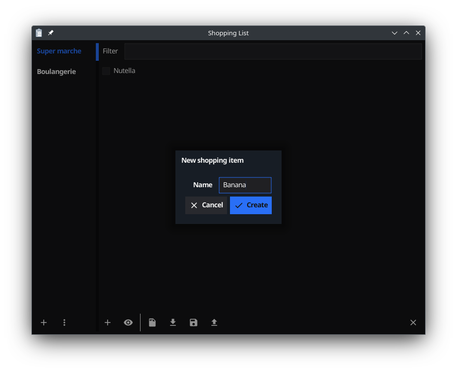

  
  

# Shopping
A Fyne application using BoltDB to store shopping lists used as support material article in GNU Linux Magazine France.

This application support all OS Fyne support and allow sharing shopping list between devices and user using the wormhole protocol.

Download latest binary here: https://geoffrey-artefacts.fynelabs.com/github/Bluebugs/Bluebugs/shopping/latest/index.html

## Running on macOS arm64 (M1/M2)

Binaries that are not signed with an official Apple certificate and downloaded from the web are put into quarantine by macOS (Apple computers with Intel CPUs do not exhibit this behavior). To solve this, you need to remove the quarantine attribute from the application (replacing <path to .app> with the application path):

xattr -r -d com.apple.quarantine <path to .app>

If this does not work, the amd64 binaries work fine through Rosetta.

# Screenshot

